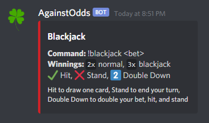
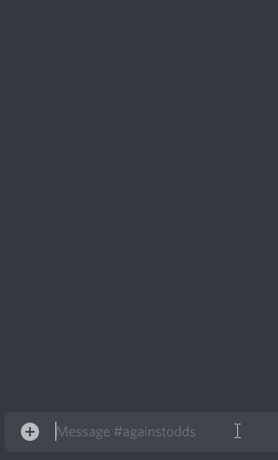
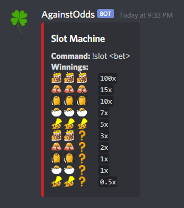
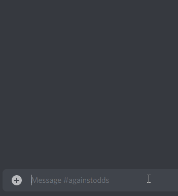
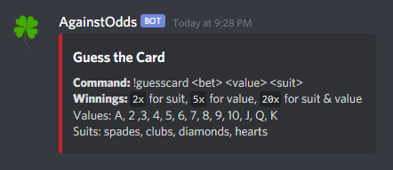
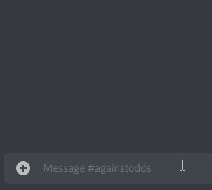
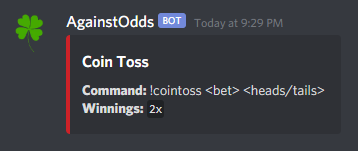
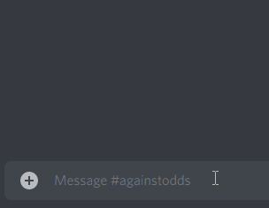

# AgainstOdds
 > Author: [Kimberly Yang](https://github.com/kimberlytyang)

## Description
 > AgainstOdds is a Discord gambling bot that allows you to risk it all in a game of odds.
 > * Language: JavaScript

## Screenshots
| Blackjack | Slot_Machine |
| :-: | :-: |
|   |   |

| Guess_the_Card | Coin_Toss |
| :-: | :-: |
|   |   |

## Setup Instructions
1. Set up a [Discord](https://discord.com/) account
    - Create a server using the `+` icon on the left bar
2. Sign into the [Discord Developer Portal](https://discord.com/developers)
    - Create a `New Application`
    - Under the `Bot` tab, create a bot, and copy the `TOKEN`
3. Install [Node.js](https://nodejs.org/en/download/) for your platform
4. Clone this repository to your local machine
    - Navigate to the `AgainstOdds` directory using the terminal
    - Create a file named `.env`, and open it in an editor
    - On the first line, type `CLIENT_TOKEN=`, followed by the bot's `TOKEN` from step 2, and save the file
    - Using the terminal, run the command `npm install && npm start`
5. Return to the Developer Portal
    - Under the `OAuth2` tab, copy the `CLIENT ID` 
    - Replace the X's in the link below with the `CLIENT ID` and navigate to the page to invite the bot to your server
    - `https://discord.com/api/oauth2/authorize?client_id=XXXXXXXXXXXXXXXXXX&permissions=306256&scope=bot`
6. The bot should now send a welcome message and appear online in your server
    - To end the bot's process, type `CTRL+C` in the terminal
    - To start up the bot, run `npm start` in the terminal
